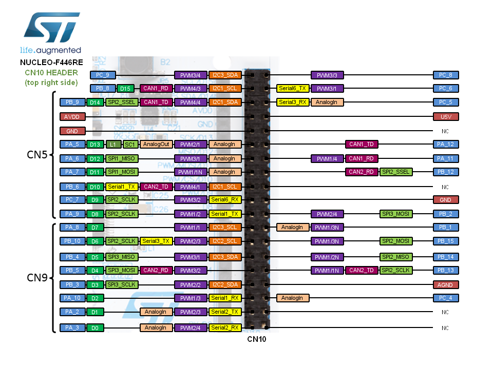

# Laser Driver Configuration

Baudrate USB = 115200

## Pinout

[Full configuration](https://www.notion.so/4fa74484b7ab4d18a4245cf4df16fc71)

## Connections
Orientation: USB port at the top:

Left side             |  Right side
:-------------------------:|:-------------------------:
  |  

## Pyrometer settings
1. Baudrate = 115200
2. PeakHold disabled